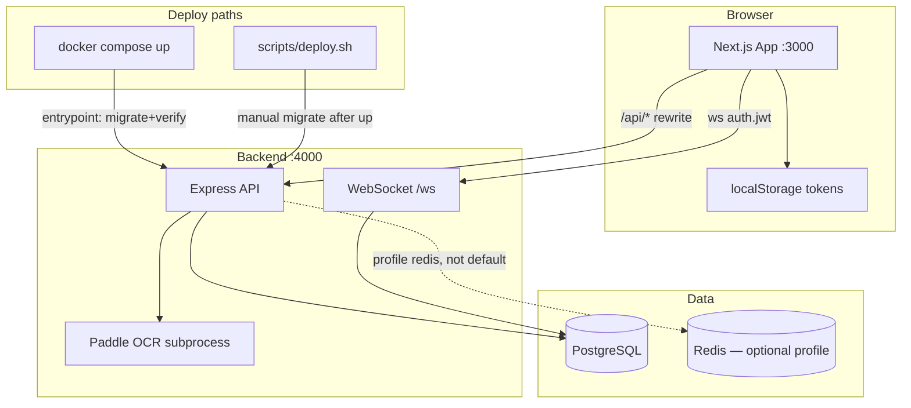
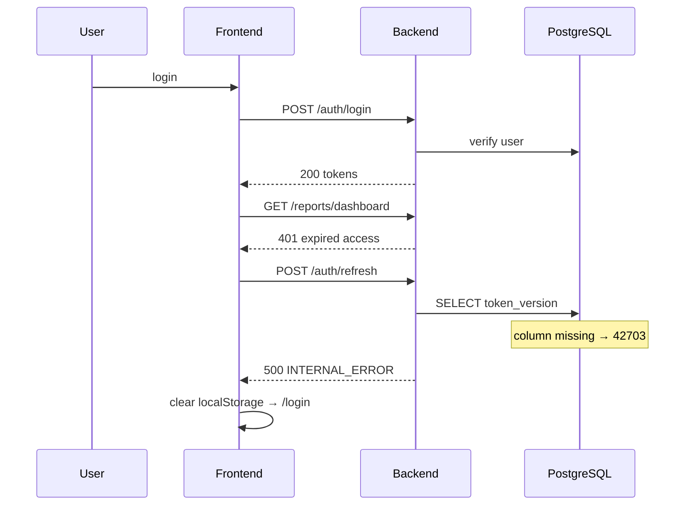

# Cut Huay — Full System Audit Report

**Date:** 2026-06-17  
**Scope:** Next.js 14 frontend + Express TypeScript backend + PostgreSQL 16 + Docker Compose  
**Auditor mode:** Code review + operational incident correlation (login bounce / schema drift)

---

## 1. Executive Summary

Cut Huay is a lottery operations platform (รับแทง, งวด, ตัดส่ง, สรุปผล) with a mature feature set but uneven operational hardening. The stack is coherent: Next.js proxies to Express on `:4000`, PostgreSQL holds business data, WebSocket pushes live updates, and OCR (Paddle/Google Vision) supports bet import.

A **confirmed production incident** showed that `docker compose up` did not run migrations while `scripts/deploy.sh` did. Missing `users.token_version` caused `POST /api/auth/refresh` to return 500; the frontend cleared tokens and redirected to `/login` after a brief dashboard flash.

**Quick wins applied in this audit cycle:**
- Docker backend entrypoint auto-runs `migrate` + `verifyMigrate` before start
- `/auth/refresh` returns 401 for invalid/expired JWT (not 500)
- RUNBOOK login-bounce troubleshooting + verify commands
- CI runs Postgres + migrate + verify before integration tests
- Docs synced (AI_HANDOVER, CHANGELOG_AI, SECURITY_CHECKLIST)

**Remediation applied (2026-06-17 phased plan):** shared `@cuthuay/bet-parser`, RBAC on reports + viewer FE gating, WS `token_version` revoke, JWT/seed hardening, backup script, dashboard `profit_by_round` batch, bets pagination, integration tests expanded, Playwright baseline.

**Top residual risks:** tokens in `localStorage` when cookie flags off (H-01); production cookie default still deferred (playbook R8 ready); PDPA customer PII purge not automated.

---

## 2. System Map



**Auth flow (login bounce incident):**



---

## 3. Findings by Severity

### Critical

| ID | Finding | Evidence | Status |
|----|---------|----------|--------|
| C-01 | Local Docker did not run migrations → schema drift breaks auth | `docker-compose.yml` (no migrate step); incident: `token_version` missing | **Fixed** — `backend/scripts/docker-entrypoint.sh` |
| C-02 | Deploy script vs Docker path inconsistency | `scripts/deploy.sh` runs migrate; compose did not | **Fixed** — entrypoint aligns paths |

### High

| ID | Finding | Evidence | Status |
|----|---------|----------|--------|
| H-01 | Access + refresh tokens in `localStorage` when cookie flags off | `frontend/src/store/useStore.ts`, `frontend/src/lib/api.ts` | **Partial** — staging: no localStorage when `NEXT_PUBLIC_COOKIE_AUTH_ENABLED`; production default off |
| H-02 | Seed credentials hardcoded (`admin/admin1234`) | `backend/src/database/seed.ts` | **Fixed** — `SEED_ADMIN_PASSWORD` / `SEED_OPERATOR_PASSWORD` or random one-time log; production guard |
| H-03 | `/auth/refresh` returned 500 on invalid JWT | `backend/src/routes/auth.ts` | **Fixed** — 401 `INVALID_REFRESH_TOKEN` |
| H-04 | Integration tests silently skip when DB unavailable | `backend/src/tests/auth.integration.test.ts` (`dbReady`) | **Fixed** — `assertDbReady` fails in CI (`CI=true`) |

### Medium

| ID | Finding | Evidence | Status |
|----|---------|----------|--------|
| M-01 | God components: `bets/page.tsx` (~1,706 LOC), `cut/page.tsx` (~1,123 LOC), `summary/page.tsx` (~433 LOC) | `frontend/src/app/*/page.tsx` | **Mostly fixed** — bets panels + RQ SSoT (R5); cut `CutRangeTableModal` (R6) |
| M-02 | FE/BE `betParser` duplication — contract drift risk | `packages/bet-parser/` | **Fixed** — shared package + contract tests |
| M-03 | Redis in compose, zero app usage | `docker-compose.yml` | **Documented** — `profiles: [redis]`; optional/unused until wired |
| M-04 | `viewer` role unclear UX/API gating | `rbac.ts`, `AppShell.tsx`, `reports.ts` | **Fixed** — RBAC matrix FE+BE |
| M-05 | Dashboard fan-out `profitSummary` per round | `reports.ts` `profit_by_round` | **Fixed** — server-side batch in `GET /api/reports/dashboard` |
| M-06 | Frontend production Docker build — no HMR on refresh | `frontend/Dockerfile` | Open — expected for prod image; monorepo build fixed for `bet-parser` |

### Low

| ID | Finding | Evidence | Status |
|----|---------|----------|--------|
| L-01 | PostgreSQL NUMERIC precision | `backend/src/lib/money.ts`, `database.ts` OID 1700 → string | **Mitigated R8** — `moneyToNumber` at calc boundaries; contract tests |
| L-02 | Default `JWT_SECRET` in compose | `docker-compose.yml` | **Fixed** — `JWT_SECRET:?` required from `.env` |
| L-03 | No frontend automated tests | `frontend/e2e/` | **Mitigated** — 3 Playwright tests; CI `e2e_required` |

---

## 4. UI/UX Review Matrix (17 routes)

| Route | Purpose | Auth gate | Loading/error | Notes |
|-------|---------|-----------|---------------|-------|
| `/` | Dashboard | Yes | Partial | Profit charts; depends on reports API |
| `/login` | Auth | Public | Good | Rate limit UX on 429 |
| `/bets` | รับแทงหลัก | Yes | Complex | ~1,702 LOC; `BetKeyInputPanel`, `BetSummaryPanel`, grid/voice/line/move; `useBetsQuery` SSoT |
| `/bets/all` | ดูโพยทั้งหมด | Yes | OK | Typography hierarchy; column/table layout toggle |
| `/bets/import` | Import โพย | Yes | OK | Large payload path |
| `/bets/search` | ค้นหาโพย | Yes | OK | |
| `/cut` | ตัดส่ง | Yes | Complex | ~1,123 LOC; `CutToolbar`, `CutRiskPanel`, `CutSendBatchesPanel`, `CutRangeTableModal` |
| `/summary` | สรุปผล | Yes | Good | Print panels; draw date in headers |
| `/summary/compare` | เปรียบเทียบสรุป | Yes | OK | Newer route |
| `/rounds` | จัดการงวด | Yes | OK | |
| `/customers` | ลูกค้า | Yes | OK | |
| `/dealers` | เจ้ามือ | Yes | OK | |
| `/limits` | เพดาน | Yes | OK | |
| `/results` | ผลรางวัล | Yes | OK | |
| `/notebook` | บันทึก | Yes | OK | localStorage notes |
| `/settings` | ตั้งค่า | Yes | OK | |
| `/settings/users` | ผู้ใช้ | Admin | OK | Direct localStorage token read |

**UX gaps:** login bounce (fixed at ops layer); no global offline indicator; viewer role flows undocumented; Docker frontend requires rebuild for UI changes.

---

## 5. Security & Compliance Gaps

| Area | Status | Detail |
|------|--------|--------|
| Auth transport | **Gap** | Bearer + refresh in localStorage |
| CSRF | **Infra ready** | `csrf.ts` + `/auth/csrf`; enforcement when `CSRF_ENABLED` + `COOKIE_AUTH_ENABLED` (default off) |
| Rate limiting | Done | Global 5000/15m + login 8/15m |
| Session revoke | Done | `users.token_version` + logout-all |
| Audit log | Partial | Login/refresh/logout; round delete, bulk bet delete, round import |
| Secret management | Improved | `.env` required for `JWT_SECRET`; fail-fast in production `env.ts` |
| LINE removal | Done | migrate12 drops legacy tables |
| Error envelope | Done | `{ error, code, trace_id }` |
| PDPA / retention | **Partial R8** | `purgeRetention.ts` dry-run default; `SECURITY_CHECKLIST` template; audit_log scope only |

---

## 6. Tech Debt Register

| Item | Effort | Impact | Priority |
|------|--------|--------|----------|
| Cookie + CSRF phased migration | Large | High security | P1 |
| Expand integration tests (export, cut send) | Medium | Reliability | P1 — import/summary/bulk/result + CSRF **done** (**28** default; +1 cookie +2 CSRF with flags) |
| Shared parser/types package | Medium | Maintainability | P2 — **Done** (`packages/bet-parser`) |
| Split god pages into hooks/components | Large | Maintainability | P2 — **Mostly done** (cut &lt;1,400; bets ~1,700 with panels + RQ SSoT) |
| CSRF phase 2 infrastructure | Medium | Security | P1 — **Infra ready** (`CSRF_ENABLED` off by default) |
| Redis: optional profile, unused | Small | Infra hygiene | P3 — **Documented only** (ไม่ wire ใน R8; เปิดเมื่อ multi-instance rate-limit)
| NUMERIC precision (decimal.js or string) | Small | Financial accuracy | P3 — **Mitigated R8** (`money.ts` + tests) |

---

## 7. Improvement Roadmap

### Quick Wins (this cycle — done)

1. Docker entrypoint: migrate + verify before API start
2. Auth refresh: 401 on invalid JWT
3. RUNBOOK: login-bounce troubleshooting
4. CI: Postgres + migrate + verify + integration tests
5. Docs sync

### Near-term (next 1–2 sprints)

| Priority | Epic | Rationale |
|----------|------|-----------|
| P1 | Cookie + CSRF phased migration | Reduce XSS token theft |
| P1 | CSRF reject/accept tests + staging cookie pilot | Security cutover readiness |
| P1 | Integration tests: export-bulk, cut send (optional) | Remaining API gaps |
| P2 | Shared parser/types package | Reduce FE/BE drift — **done** |
| P2 | Viewer read-only `/bets` + cut modal extraction | Onboarding velocity — god pages mostly split |

### Mid-term

| Priority | Epic | Rationale |
|----------|------|-----------|
| P3 | E2E expand (bet → summary) | **Done R8** — `bet-summary.spec.ts` |
| P3 | Redis wire for rate-limit | Only if multi-instance |
| P3 | ~~NUMERIC precision (L-01)~~ | **Done R8** |
| P3 | Production TLS + reverse proxy hardening | Playbook R8 (`COOKIE_SECURE`, nginx example) — cutover ops-gated |
| P3 | PDPA retention automation | **Skeleton R8** — audit_log dry-run; customer PII defer |

---

## 8. Verification Checklist

```bash
# Docker full path (auto-migrate via entrypoint)
docker compose down
docker compose up -d --build
curl -s http://localhost:4000/health
curl -s -X POST http://localhost:3000/api/auth/login \
  -H "Content-Type: application/json" \
  -d '{"username":"admin","password":"YOUR_SEED_OR_BOOTSTRAP_PASSWORD"}'
# Dev seed: set SEED_ADMIN_PASSWORD in .env before `npm run seed`, or read one-time password from seed log

# Schema verify
docker compose exec backend node dist/database/verifyMigrate.js
docker compose exec postgres psql -U cuthuay -d cuthuay \
  -c "SELECT column_name FROM information_schema.columns WHERE table_name='users' AND column_name='token_version';"

# Tests
cd backend && npm run test:integration
cd frontend && npm run build
```

**Manual smoke:** login → dashboard stays → สรุป/โพย/ตัด load without redirect loop.

---

## 9. Audit Dimensions Summary

| Dimension | Grade | Key note |
|-----------|-------|----------|
| Architecture | B | Clear FE/BE/DB boundaries; WS + OCR well isolated |
| Source code | B | Shared parser; cut split substantial; bets page still large |
| UI/UX | B- | Operator-focused; login bounce was ops pain |
| Database | B+ | Idempotent migrate + verify; meta tracking |
| API | B | Zod validation, error envelope; some large handlers |
| Security | B- | JWT solid; seed fixed; localStorage still open |
| Performance | B | Dashboard batch profits; bets pagination API |
| Maintainability | B | Parser unified; cut split R4; bets RQ step 1 wired |
| Scalability | B- | Stateless API; WS single-node; Redis optional profile |
| QA | B- | Integration 20 tests; Playwright optional |
| Documentation | B+ | Synced post-remediation (this update) |
| Roadmap | — | See §7 |

---

*Generated as part of Full Audit + Quick Wins plan. Do not edit the plan file; this report is the deliverable.*
