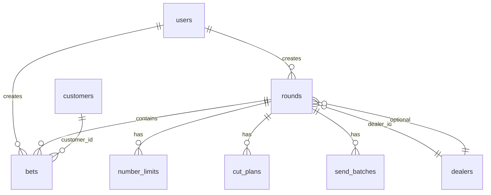

# Database Schema — Cut Huay

PostgreSQL; สคีมาหลักอยู่ใน `backend/src/database/migrate.ts` (single canonical entrypoint)

## Entity diagram (หลัก)

## Tables

### `users`

| Column | Notes |
|--------|-------|
| `role` | CHECK: `admin`, `operator`, `viewer` |
| `username` | UNIQUE |
| `password_hash` | bcrypt |
| `token_version` | session versioning สำหรับ revoke token lifecycle |

### `rounds`

| Column | Notes |
|--------|-------|
| `status` | `open`, `closed`, `drawn`, `archived` |
| `draw_date` | DATE — business rule: หนึ่งงวดต่อวัน (app-level) |
| `dealer_id` | FK → `dealers` |
| `result_data` | JSONB ผลรางวัลเต็ม |

### `bets`

| Column | Notes |
|--------|-------|
| `bet_type` | 7 ประเภท (รวม `3digit_tote`, `1digit_*`) |
| `amount` | CHECK > 0 |
| `sheet_no`, `sort_order` | จัดแผ่น/ลำดับ |
| `import_batch_id`, `segment_index` | โพยไลน์/import |
| `updated_at` | migrate11 |

**Indexes:** `idx_bets_round_id`, `idx_bets_number_type`, `idx_bets_sort_order`, `idx_bets_import_batch`

### `customers`, `dealers`

อัตราจ่าย/คอมมิชชันต่อประเภท (`pct_*`, `rate_*`); dealers มี `keep_net_pct`

### `number_limits`

| Feature | Implementation |
|---------|----------------|
| Per-entity | `entity_type` (`all`, `customer`, `dealer`), `entity_id` |
| Unique | Partial indexes `nl_unique_all`, `nl_unique_entity` |

### `cut_plans`

`cuts` JSONB, `total_cost`, `risk_limit`, `dealer_rates` JSONB

### `send_batches`

`items` JSONB, `threshold`, FK `round_id`, `dealer_id`

### `audit_log`

`user_id`, `action`, `details` JSONB, `ip_address`, `created_at`

Retention (R8 skeleton, default off): `backend/src/scripts/purgeRetention.ts` — env `AUDIT_LOG_RETENTION_DAYS` (default 90), `PDPA_PURGE_ENABLED=false`, `PDPA_PURGE_DRY_RUN=true`; ดู `RUNBOOK.md` §11

### Deprecated artifacts cleanup

เลิกใช้ LINE integration แล้ว และมี cleanup SQL ใน:

- `backend/src/database/migrate.ts`
- `backend/src/database/migrate12.ts`

โดยใช้ `DROP TABLE IF EXISTS line_webhook_log` และ `line_integration_settings`

## Migration strategy

| Script | ใช้เมื่อ |
|--------|----------|
| `npm run migrate` → `migrate.ts` | **Canonical deterministic migration path** (fresh + existing DB) |
| `npm run migrate:verify` | ตรวจ schema หลัง migrate (required in rollout checklist) |
| `migrate10.ts`, `migrate11.ts`, `migrate12.ts`, `migrate13.ts` | Compatibility wrappers เท่านั้น (deprecated) |

Policy:
1. naming: migration wrappers ใช้ `migrateNN.ts` (NN เพิ่มตามลำดับ)
2. ordering: deploy ใช้ `npm run migrate` เท่านั้น (wrapper ไม่ใช่เส้นทางหลัก)
3. idempotency: ต้องใช้ safe DDL (`IF NOT EXISTS`, additive-first)
4. rollback note: ทุก migration ต้องระบุ fallback ใน docs/changelog ก่อน merge
5. verify: หลัง migrate ต้องรัน `npm run migrate:verify`

`migrate.ts` บันทึกสถานะลง `schema_migration_meta.schema_version` เพื่อ track rollout เวอร์ชันสคีมา

## Data risks

| Risk | Detail |
|------|--------|
| Import round ด้วย fixed UUID | `importOneRoundPack` skip ถ้ามี id แล้ว |
| Seed ใน production | `seed.ts` ปฏิเสธเมื่อ `NODE_ENV=production`; dev ใช้ `SEED_ADMIN_PASSWORD` / `SEED_OPERATOR_PASSWORD` (≥6 ตัว) หรือสุ่มรหัสครั้งเดียวใน log — ไม่มีรหัสคงที่ `admin1234` |
| DELETE round | ลบ bets/send_batches ใน app ก่อนลบ round (ไม่พึ่ง ON DELETE ทั้งหมด) |
| Float parsing | **แก้แล้ว (R8):** OID 1700 (NUMERIC) คืน `string` จาก `pg`; แปลงผ่าน `lib/money.ts moneyToNumber()` ที่จุดคำนวณ — ไม่ใช้ `parseFloat` โดยตรงแล้ว |
| Legacy LINE tables ค้างใน DB เก่า | cleanup โดย `migrate12` หรือ `migrate` เวอร์ชันใหม่ |
| Wrapper scripts ถูกใช้แทน canonical path | อาจ bypass policy/verify ทำให้ drift |

## Recommended indexes (future)

- `rounds(draw_date)` — ถ้า list/filter ช้า
- `bets(customer_id)` WHERE ใช้ filter ลูกค้าบ่อย
- `profit-summary` queries — วิเคราะห์จาก `EXPLAIN` บน production-like data
