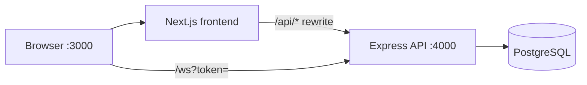

# Cut Huay (AuraX) — System Overview

ระบบจัดการความเสี่ยงโพยหวย: รับแทง → จำกัดเลข/อัตรา → ตัดส่งเจ้ามือ → สรุปผลหลังออกรางวัล

## Stack

| Layer | Tech | Path |
|-------|------|------|
| Frontend | Next.js 14 (App Router), React 18, Zustand, Tailwind | `frontend/` |
| Backend | Express 4, TypeScript, Zod, `pg` | `backend/` |
| Database | PostgreSQL 16 | migrations: `backend/src/database/migrate.ts` |
| Realtime | WebSocket (`ws`) on same HTTP server | `backend/src/websocket/handler.ts` |
| Infra | Docker Compose | `docker-compose.yml` |
| OCR (optional) | PaddleOCR (Python in backend image), Google Vision | `backend/src/services/imageOcr.ts` |

**หมายเหตุ:** Redis ถูกประกาศใน `docker-compose.yml` แต่ **ไม่มีการใช้งานในโค้ดแอป** (Need confirmation: วางแผนใช้หรือลบ service)

## Architecture (runtime)

## Module map

### Frontend (`frontend/src/`)

| Area | Path | หน้าที่ |
|------|------|--------|
| App routes | `app/` | `bets`, `cut`, `rounds`, `summary`, `customers`, `dealers` (redirect), `reports`, `results` (redirect), `settings`, `login` |
| API client | `lib/api.ts` | Axios + Bearer จาก `localStorage` |
| Auth state | `store/useStore.ts` | Zustand persist `cuthuay-auth` |
| Layout | `components/layout/AppShell.tsx` | Gate login; จำกัด `operator` → `/bets`, `/rounds` |
| Bet parsing (client) | `lib/betParser.ts` | Parse ข้อความโพย (ซ้ำ logic กับ backend) |
| WebSocket | `lib/websocket.ts` | เชื่อม `/ws?token=` |

### Backend (`backend/src/`)

| Area | Path | หน้าที่ |
|------|------|--------|
| Entry | `index.ts` | Helmet, CORS, rate limit, routes, WS |
| Auth | `middleware/auth.ts`, `routes/auth.ts` | JWT Bearer, roles `admin` / `operator` / `viewer` |
| Domain routes | `routes/*.ts` | bets, rounds, cut, limits, reports, customers, dealers |
| OCR | `services/imageOcr.ts`, `googleVisionOcr.ts`, `paddleOcr.ts` | OCR pipeline สำหรับรูปโพย |
| Risk / cut | `services/riskEngine.ts`, `cutAlgorithm.ts` | คำนวณ exposure / แผนตัด |
| Reports | `services/reportService.ts`, `services/profitSummaryService.ts`, `services/dashboardProfits.ts` | PDF + profit summary |
| Money util | `lib/money.ts` | แปลง PostgreSQL NUMERIC → number ปลอดภัย (ไม่ใช้ parseFloat โดยตรง) |
| DB | `config/database.ts` | Pool + `withTransaction`; OID 1700 → string (ใช้ `moneyToNumber()`) |

## Shared contracts

- **Types (backend source of truth):** `backend/src/models/types.ts` — `BetType`, `UserRole`, payout defaults
- **Frontend mirror:** `frontend/src/types/index.ts` — ควร sync กับ backend เมื่อเพิ่ม bet type
- **Bet text parser:** `backend/src/lib/betParser.ts` และ `frontend/src/lib/betParser.ts` — **ไม่ share package** (เสี่ยง drift)

## Auth flow (สรุป)

1. `GET /api/auth/setup-status` — ไม่ต้อง login
2. ถ้า `needs_first_user`: `POST /api/auth/bootstrap` → admin คนแรก
3. `POST /api/auth/login` → JWT
4. Route ส่วนใหญ่: `router.use(authenticate)` ในแต่ละ router
5. Mutation: `authorize('admin')` หรือ `authorize('admin','operator')` ต่อ endpoint

## Deploy paths

| วิธี | Script / คำสั่ง |
|------|------------------|
| Local dev | `./start-dev.sh` (migrate + seed + dev servers) |
| Docker | `docker compose up -d` + migrate ใน container |
| Remote | `scripts/deploy.sh` (rsync + `docker compose` + `migrate.js`) |

## Quality gates (R8)

| Gate | คำสั่ง | หมายเหตุ |
|------|--------|----------|
| Backend integration | `cd backend && npm run test:integration` | **28** tests default (+ cookie/csrf scripts แยก) |
| E2E Playwright | `cd frontend && npm run test:e2e` | 3 tests — ต้อง stack + `E2E_PASS` |
| PDPA purge dry-run | `cd backend && npm run purge:retention` | ต้องมี Postgres; default ไม่ลบข้อมูล |

## เอกสารที่เกี่ยวข้อง

- [API_REFERENCE.md](./API_REFERENCE.md)
- [DB_SCHEMA.md](./DB_SCHEMA.md)
- [RUNBOOK.md](./RUNBOOK.md)
- [SECURITY_CHECKLIST.md](./SECURITY_CHECKLIST.md)
- [DECISIONS.md](./DECISIONS.md)
- [AI_HANDOVER.md](./AI_HANDOVER.md)
