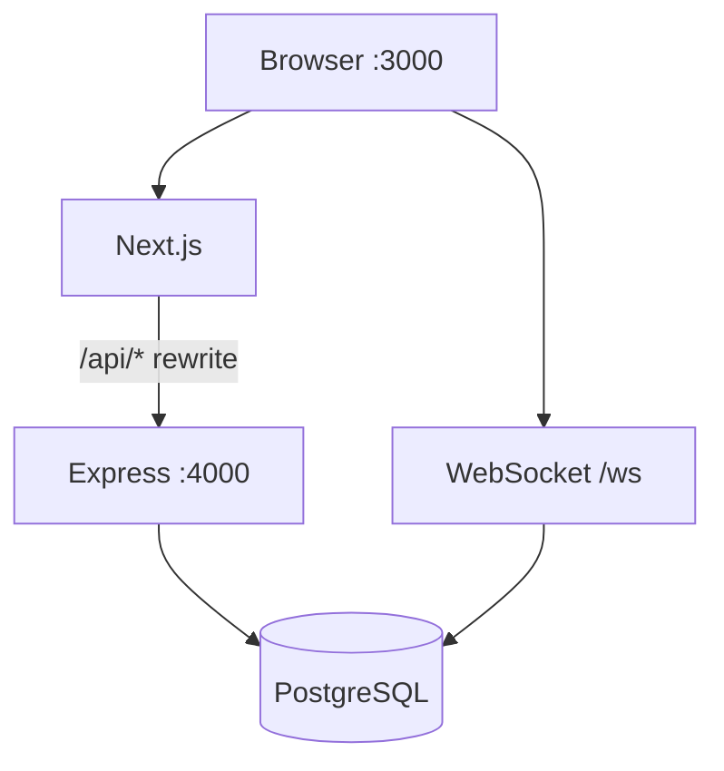

# Cut Huay (AuraX) — System Documentation

**Version:** 2026-06-17  
**Stack:** Next.js 14 + Express TypeScript + PostgreSQL 16 + Docker Compose

---

## 1. Overview

Cut Huay is an internal lottery operations platform for teams that receive bets, manage risk exposure, cut/send to dealers, and summarize results after draws.

**Core workflow:** Create round → Receive bets → Set limits → Cut/send → Close round → Enter results → Summary & reports

**Repository layout:**

| Path | Purpose |
|------|---------|
| `frontend/` | Next.js 14 App Router UI |
| `backend/` | Express API, migrations, OCR |
| `docs/` | System docs, runbook, API reference |
| `docker-compose.yml` | Local/production container orchestration |
| `scripts/deploy.sh` | Remote rsync + Docker deploy |

---

## 2. Architecture



- **Frontend:** Client-heavy React pages, Zustand auth, Axios API client
- **Backend:** REST `/api/*`, JWT auth, Zod validation, structured JSON logs
- **Realtime:** WebSocket on same HTTP server; JWT via `Sec-WebSocket-Protocol`
- **OCR:** PaddleOCR (Python in container) + optional Google Vision

See also: `docs/README_SYSTEM.md`, `docs/AUDIT_FULL_REPORT.md`

---

## 3. Database

**Engine:** PostgreSQL 16  
**Canonical migration:** `npm run migrate` → `backend/src/database/migrate.ts`  
**Verification:** `npm run migrate:verify` → `verifyMigrate.ts`

### Tables

| Table | Purpose |
|-------|---------|
| `users` | Auth, roles, `token_version` for revoke |
| `rounds` | Lottery rounds, status, results, dealer link |
| `bets` | Individual bet lines |
| `customers` | Customer rates & commission |
| `dealers` | Dealer rates & keep % |
| `number_limits` | Per-number caps, blocks, entity overrides |
| `cut_plans` | Cut simulation results (JSONB) |
| `send_batches` | Sent cut batches (JSONB items) |
| `audit_log` | Login and security events |
| `schema_migration_meta` | Schema version tracking |

### Key relationships

- `rounds` → `users` (created_by), `dealers` (dealer_id)
- `bets` → `rounds` (CASCADE), `customers` (SET NULL), `users` (created_by)
- `number_limits`, `cut_plans`, `send_batches` → `rounds` (CASCADE)

See: `docs/DB_SCHEMA.md`

---

## 4. APIs

**Base (browser):** `http://localhost:3000/api/...` (rewrites to backend)  
**Base (direct):** `http://localhost:4000/api/...`

**Auth:** `Authorization: Bearer <JWT>`

| Group | Prefix | Key endpoints |
|-------|--------|---------------|
| Auth | `/api/auth` | login, refresh, bootstrap, me, users CRUD |
| Rounds | `/api/rounds` | CRUD, import/export, result |
| Bets | `/api/bets` | CRUD, bulk, search, OCR, PDF parse |
| Cut | `/api/cut` | risk, simulate, apply, send-batches |
| Limits | `/api/limits` | per-round limits |
| Reports | `/api/reports` | dashboard, summary, profit-summary, PDF |
| Customers | `/api/customers` | CRUD, import/export |
| Dealers | `/api/dealers` | CRUD, import/export |

**Error format:** `{ error, code, trace_id }` + header `x-request-id`

See: `docs/API_REFERENCE.md`

---

## 5. Modules

### Frontend routes

| Route | Module |
|-------|--------|
| `/` | Dashboard |
| `/login` | Authentication |
| `/rounds` | Round management |
| `/bets`, `/bets/all`, `/bets/search`, `/bets/import` | Bet entry & views |
| `/cut` | Cut/send operations |
| `/limits` | Number limits |
| `/summary`, `/summary/compare` | Results & P&L |
| `/customers` | Customers & dealers |
| `/dealers` | Redirect → `/customers?tab=dealer` |
| `/reports` | Round report viewer (risk + PDF) |
| `/results` | Redirect → `/summary` (legacy path compat) |
| `/settings`, `/settings/users` | System & user admin |
| `/notebook` | Local notes (browser storage) |

### Backend modules

| Path | Responsibility |
|------|----------------|
| `routes/*.ts` | HTTP handlers |
| `services/riskEngine.ts` | Exposure calculation |
| `services/cutAlgorithm.ts` | Cut planning |
| `services/imageOcr.ts` | OCR pipeline |
| `services/profitSummaryService.ts` | Profit summary queries |
| `services/dashboardProfits.ts` | Dashboard batch profit extras |
| `services/reportService.ts` | PDF report generation |
| `lib/betParser.ts` | Text bet parsing |
| `lib/money.ts` | NUMERIC → number (precision-safe) |
| `lib/logger.ts` | Structured JSON logging |
| `middleware/auth.ts` | JWT + RBAC |
| `websocket/handler.ts` | Realtime broadcast |

---

## 6. User Roles

| Role | Description | Frontend access | Backend mutations |
|------|-------------|-----------------|-------------------|
| `admin` | Full control | All routes | All authorized endpoints |
| `operator` | Bet entry staff | `/bets*`, `/rounds` only | bets create, some rounds/cut |
| `viewer` | Read-only | All read routes (reports, rounds list, bets list, cut risk view) | `authenticate` + `authorize` on reports; mutations blocked |

Operator gating: `AppShell.tsx` + `frontend/src/lib/rbac.ts` redirect non-allowed paths to `/bets`. Viewer cannot access `/settings`, user management, or destructive actions.

**Cookie auth (phase 1):** `COOKIE_AUTH_ENABLED=true` sets httpOnly cookies alongside Bearer; dual-read in `auth` middleware. Full CSRF cutover deferred until HTTPS/reverse proxy.

---

## 7. Workflows

### Daily operations

1. Admin opens/creates round (`/rounds`)
2. Staff enters bets (`/bets`) — keyboard, paste, OCR
3. Admin sets limits (`/limits`)
4. Admin runs cut (`/cut`) and creates send batches
5. Round closed when betting ends
6. Results entered on `/summary`
7. P&L reviewed, printed, or exported PNG

### First deploy

1. `docker compose up -d --build` (backend auto-migrates)
2. `GET /api/auth/setup-status` → if `needs_first_user`, bootstrap admin
3. Or run `npm run seed` locally (dev only) — set `SEED_ADMIN_PASSWORD` / `SEED_OPERATOR_PASSWORD` in `.env` first
4. Login → verify dashboard loads

### Auth token lifecycle

1. Login → access + refresh tokens
2. Access expires → frontend auto-refresh once
3. Logout-all → `token_version++` → all tokens invalidated

---

## 8. Deployment Guide

### Local Docker

```bash
cp .env.example .env   # edit JWT_SECRET, passwords
docker compose up -d --build
curl http://localhost:4000/health
```

Backend entrypoint runs `migrate` + `verifyMigrate` before start.

### Local dev (hot reload)

```bash
./start-dev.sh
# or separately: backend npm run dev, frontend npm run dev
```

### Remote deploy

```bash
export SERVER=user@host
export REMOTE_PATH=/path/to/Cut\ Huay
./scripts/deploy.sh
```

Deploy script: rsync → `docker compose build` → `up -d` → migrate.

See: `docs/RUNBOOK.md`

---

## 9. Environment Variables

| Variable | Required | Description |
|----------|----------|-------------|
| `DATABASE_URL` | Yes | PostgreSQL connection string |
| `JWT_SECRET` | Yes | Min 32 chars; access token signing |
| `JWT_REFRESH_SECRET` | No | Refresh signing (defaults to JWT_SECRET) |
| `JWT_EXPIRES_IN` | No | Default `8h` |
| `REFRESH_EXPIRES_IN` | No | Default `7d` |
| `CORS_ORIGIN` | No | Default `http://localhost:3000` |
| `PORT` | No | Backend port, default 4000 |
| `NODE_ENV` | No | development / production / test |
| `REPORTS_DIR` | No | Generated report files |
| `POSTGRES_*` | Docker | Compose postgres service |
| `BACKEND_INTERNAL_URL` | Docker | Frontend rewrite target |
| `GOOGLE_APPLICATION_CREDENTIALS` | OCR | Vision API key path |
| `PADDLE_OCR_PYTHON` | OCR | Python binary in container |

Template: `.env.example`, `scripts/nutanix.env.example`

---

## 10. Backup Strategy

### Database

**Recommended (production):**

```bash
# Scheduled pg_dump
docker compose exec -T postgres pg_dump -U cuthuay -Fc cuthuay > backup_$(date +%Y%m%d).dump

# Restore
docker compose exec -T postgres pg_restore -U cuthuay -d cuthuay --clean < backup.dump
```

**Application-level export:**

- `GET /api/rounds/:id/export` — single round JSON
- `POST /api/rounds/export-bulk` — multiple rounds
- `GET /api/customers/export`, `/api/dealers/export` — master data

### Volumes

- `postgres_data` — primary data (backup required)
- `redis_data` — unused by app (optional)
- `./backend/reports` — generated PDFs (secondary)

### Pre-migration / deploy

1. Snapshot DB before `migrate` on production
2. Never use `RESET_VOLUMES=true` without explicit approval

---

## 11. Disaster Recovery

| Scenario | Response |
|----------|----------|
| Schema drift / login bounce | Run `verifyMigrate`; rebuild backend (auto-migrate) |
| Bad migration | Restore DB snapshot; rollback code; re-deploy previous image |
| JWT secret leak | Rotate `JWT_SECRET`; all users re-login |
| Data corruption | Pause writes; restore latest `pg_dump`; validate sample rounds |
| Container failure | `docker compose restart`; check logs via `trace_id` |
| Full host loss | Restore Postgres dump + `.env` secrets on new host; `docker compose up` |

**RTO/RPO:** Not formally defined — recommend daily DB backups, RPO ≤ 24h for internal ops.

**Incident checklist:** `docs/RUNBOOK.md` §6, §7

---

## Related documents

- `docs/API_REFERENCE.md`
- `docs/DB_SCHEMA.md`
- `docs/RUNBOOK.md`
- `docs/SECURITY_CHECKLIST.md`
- `docs/AUDIT_FULL_REPORT.md`
- `docs/AI_HANDOVER.md`
